# Deteksi Anomali pada Indikator Ekonomi Makro Menggunakan Local Outlier Factor (LOF) sebagai Early Warning System Krisis Ekonomi

**Disusun oleh:** Amir
**Mata Kuliah:** Data Mining (Semester 6, 2026)
**Bagian dari proyek kelompok:** *Deteksi Anomali pada Indikator Ekonomi Makro sebagai Early Warning System Krisis Ekonomi menggunakan Pendekatan Unsupervised Learning*

---

## 1. Pendahuluan

### 1.1 Latar Belakang

Krisis ekonomi merupakan fenomena yang berulang dalam sistem perekonomian global dan memiliki dampak yang sangat luas terhadap kesejahteraan masyarakat, stabilitas keuangan, serta pertumbuhan negara-negara di seluruh dunia (Reinhart & Rogoff, 2009). Sejak akhir abad ke-20, dunia telah menyaksikan berbagai krisis besar, mulai dari Krisis Keuangan Asia 1997–1998, *Global Financial Crisis* (GFC) 2008–2009, Krisis Utang Eropa 2010–2012, hingga resesi akibat pandemi COVID-19 pada tahun 2020. Masing-masing krisis tersebut meninggalkan dampak sosial dan ekonomi yang sangat signifikan, termasuk lonjakan pengangguran, penurunan tajam Produk Domestik Bruto (PDB), dan instabilitas sistem keuangan (Laeven & Valencia, 2018).

Model *Early Warning System* (EWS) tradisional umumnya dibangun di atas fondasi ekonometrika (*probit/logit models*) yang mensyaratkan asumsi linearitas dan distribusi normal (Kaminsky, Lizondo, & Reinhart, 1998). Asumsi ini sulit dipenuhi oleh data ekonomi makro riil, yang cenderung memiliki pola non-linear serta interaksi antar indikator yang kompleks. Di sisi lain, krisis merupakan peristiwa langka (*rare event*) sehingga pendekatan *supervised learning* terkendala oleh kelangkaan data berlabel dan ketidakseimbangan kelas yang ekstrem. Kondisi ini mendorong penggunaan pendekatan *unsupervised anomaly detection*, yang mampu mengidentifikasi observasi yang menyimpang dari pola normal tanpa memerlukan label krisis secara eksplisit, baik pada tahap pelatihan model maupun pada tahap pemilihan hyperparameter (Chandola, Banerjee, & Kumar, 2009).

Di antara berbagai paradigma deteksi anomali, pendekatan *density-based* menawarkan perspektif yang berbeda dari pendekatan berbasis jarak global atau kompresi. **Local Outlier Factor (LOF)**, yang diperkenalkan oleh Breunig et al. (2000), menilai keanomalian suatu observasi secara relatif terhadap kerapatan lokal tetangga-tetangganya, bukan terhadap keseluruhan populasi data. Karakteristik ini secara konseptual relevan untuk konteks ekonomi makro global: sebuah negara dapat dikatakan mengalami tekanan anomali bila indikatornya menyimpang jauh dari *peer group* regionalnya (misalnya kawasan ASEAN atau Eropa), meskipun secara nilai absolut indikator tersebut belum tentu ekstrem dibandingkan populasi 49 negara secara keseluruhan. LOF sehingga berpotensi menangkap anomali kontekstual regional yang mungkin terlewat oleh metode yang mengasumsikan kerapatan global seragam.

Laporan ini menyajikan implementasi LOF sebagai satu dari enam algoritma *unsupervised* yang dibandingkan dalam proyek kelompok EWS krisis ekonomi, menggunakan data 14 indikator makroekonomi dari 49 negara sepanjang 1990–2024 yang bersumber dari *World Bank Global Economic Monitor*.

### 1.2 Identifikasi Masalah

1. Keterbatasan metode konvensional dalam menangkap pola non-linear dan interaksi kompleks antar indikator ekonomi makro.
2. Kelangkaan data berlabel akibat sifat krisis yang jarang terjadi, sehingga pendekatan *unsupervised* menjadi jalan keluar yang lebih realistis.
3. Heterogenitas struktural antarnegara: negara maju, berkembang, dan negara dengan ekonomi sangat terbuka memiliki profil indikator yang berbeda, sehingga definisi "normal" bersifat kontekstual, bukan global. Ini memunculkan pertanyaan apakah pendekatan berbasis kerapatan lokal (seperti LOF) lebih unggul menangkap anomali dibandingkan pendekatan berbasis kerapatan/jarak global.
4. Sensitivitas terhadap parameter: performa LOF bergantung pada pemilihan `n_neighbors`, sehingga diperlukan skema pemilihan yang sistematis namun tetap tidak bergantung pada label krisis di tahap manapun sebelum evaluasi.

### 1.3 Tujuan

1. Mengimplementasikan algoritma Local Outlier Factor untuk mendeteksi anomali pada 14 indikator makroekonomi dari 49 negara (1990–2024).
2. Menentukan konfigurasi `n_neighbors` secara label-free, melalui agregasi maksimum skor LOF pada rentang nilai k sesuai rekomendasi asli Breunig et al. (2000).
3. Mengevaluasi performa LOF terhadap *ground truth* eksternal (basis data krisis per negara-tahun bergaya IMF/Laeven-Valencia) menggunakan metrik Precision, Recall, F1-Score, ROC-AUC, dan Average Precision, serta membuktikan stabilitas hasil lewat *robustness check* berbasis *resampling*.
4. Menginterpretasikan hasil deteksi per periode krisis dan per negara untuk memahami kekuatan dan keterbatasan LOF sebagai komponen EWS.
5. Memberikan kontribusi hasil yang kompatibel dengan lima algoritma lain dalam proyek kelompok untuk tahap agregasi *Majority Voting*.

---

## 2. Kajian Literatur

### 2.1 Konsep dan Definisi

#### 2.1.1 Krisis Ekonomi dan *Early Warning System*
Krisis ekonomi didefinisikan sebagai periode ketika perekonomian suatu negara mengalami penurunan tajam pada indikator-indikator fundamental seperti PDB, nilai tukar, dan stabilitas sistem keuangan (Claessens & Kose, 2013). *Early Warning System* dirancang untuk mendeteksi sinyal-sinyal awal ketidakseimbangan ekonomi makro sebelum krisis terjadi secara penuh, sehingga otoritas memiliki waktu yang cukup untuk mengambil langkah mitigasi (Kaminsky et al., 1998).

#### 2.1.2 Deteksi Anomali Berbasis Kerapatan (*Density-Based*)
Deteksi anomali berbasis kerapatan berangkat dari premis bahwa observasi normal berada pada wilayah dengan kerapatan data yang tinggi, sedangkan anomali berada pada wilayah berkepadatan rendah (Chandola et al., 2009). Berbeda dengan metode berbasis jarak global (*distance-based*, misalnya k-NN) yang menilai keanomalian terhadap keseluruhan populasi, pendekatan berbasis kerapatan lokal menilai keanomalian relatif terhadap tetangga terdekat suatu titik, sehingga lebih sensitif terhadap struktur data yang tidak homogen (Breunig et al., 2000).

### 2.2 Local Outlier Factor (LOF)

LOF, yang dirumuskan oleh Breunig, Kriegel, Ng, dan Sander (2000), mengukur derajat keanomalian suatu titik data melalui empat konsep bertingkat:

1. **k-distance(p)**: jarak dari titik *p* ke tetangga ke-*k* terdekatnya.
2. **Reachability distance**: `reach-dist_k(p,o) = max(k-dist(o), d(p,o))`, yaitu jarak efektif dari *p* ke *o* yang "dihaluskan" agar tidak terlalu sensitif terhadap fluktuasi lokal.
3. **Local Reachability Density (LRD)**: kebalikan dari rata-rata *reachability distance* terhadap *k* tetangga terdekat; semakin padat lingkungan suatu titik, semakin tinggi nilai LRD-nya.
4. **LOF Score**: rasio rata-rata LRD tetangga terhadap LRD titik itu sendiri.

Interpretasi skor LOF: nilai mendekati 1 mengindikasikan titik berada pada kerapatan yang serupa dengan tetangganya (normal), sedangkan nilai yang jauh lebih besar dari 1 mengindikasikan titik berada pada wilayah yang jauh lebih jarang dibanding lingkungan sekitarnya (anomali). Interpretasi inilah yang mendasari ambang batas tetap `1,5` yang dipakai pada penelitian ini untuk menentukan status anomali: aturan ini berbasis literatur (setara `contamination='auto'` pada scikit-learn), bukan diturunkan dari rasio krisis pada data.

Breunig et al. (2000) juga merekomendasikan agar LOF tidak dihitung pada satu nilai `k` tunggal, melainkan pada suatu rentang `[MinPts_LB, MinPts_UB]`, dengan skor akhir tiap titik diambil dari nilai maksimum sepanjang rentang tersebut, pendekatan yang secara langsung menjawab isu sensitivitas parameter tanpa memerlukan label untuk memilih satu `k` "terbaik". Pendekatan inilah yang diadopsi pada penelitian ini (lihat §3.2).

Keunggulan konseptual LOF terhadap konteks makroekonomi global adalah kemampuannya menilai anomali secara kontekstual/regional, bukan hanya secara global: sebuah negara dapat ditandai anomali karena menyimpang dari kelompok negara dengan karakteristik struktural serupa, meskipun tidak menjadi outlier ekstrem pada skala seluruh dunia.

### 2.3 Penelitian Terkait

- **Breunig, Kriegel, Ng, & Sander (2000)** memperkenalkan LOF sebagai metrik keanomalian lokal pertama yang secara eksplisit memperhitungkan variasi kerapatan pada dataset, dan menunjukkan superioritasnya dibanding pendekatan berbasis jarak global pada dataset dengan kerapatan heterogen.
- **Auskalnis, Paulauskas, & Baskys (2018)** menerapkan LOF untuk deteksi intrusi pada lalu lintas jaringan komputer (dataset NSL-KDD), melatih model hanya pada data normal dan secara eksplisit menguji pengaruh berbagai nilai ambang batas terhadap akurasi deteksi, sejalan dengan analisis sensitivitas ambang batas yang juga dilakukan pada penelitian ini (§4.2).
- **Budiarto, Permanasari, & Fauziati (2019)** membandingkan K-Means, LOF, dan One-Class SVM untuk deteksi anomali pada data penggunaan obat rumah sakit, menemukan bahwa OC-SVM sedikit mengungguli LOF dan K-Means pada dataset mereka, namun ketiga paradigma (*partitional*, *density-based*, *boundary-based*) tetap berhasil menemukan outlier yang berbeda-beda, mendukung rasional proyek ini untuk menggabungkan LOF dengan lima paradigma lain melalui *Majority Voting* alih-alih mengandalkan satu algoritma tunggal.
- **Mokua, wa Maina, & Kiragu (2021)** membandingkan LOF, Isolation Forest, Extended Isolation Forest, dan Robust Random Cut Forest untuk deteksi anomali pada data sensor kualitas air (pH dan turbiditas) di Kenya, menemukan bahwa LOF berhasil mendeteksi seluruh outlier dengan benar pada kedua subset data yang diuji sekaligus tercepat secara komputasi dibanding tiga algoritma pembanding lainnya, menunjukkan keunggulan LOF pada data sensor/time-series berdimensi rendah selain konteks jaringan komputer dan data kesehatan yang telah dibahas di atas.
- **Sugidamayatno & Lelono (2019)** menerapkan LOF untuk deteksi fraud pada transaksi kartu kredit dan secara eksplisit memposisikan hasilnya sebagai sinyal peringatan dini (*early warning*) bagi bank, dengan akurasi LOF (96%) mengungguli algoritma pembanding INFLO (84%) dan AVF (77%) pada 1.803 transaksi dari lima nasabah, memperkuat rasional penggunaan LOF sebagai komponen EWS pada konteks finansial yang lebih luas.
- **Goldstein & Uchida (2016)** dalam evaluasi komparatif algoritma deteksi anomali *unsupervised* multivariat menemukan bahwa performa LOF cenderung menurun pada dataset berdimensi tinggi (>10 fitur) akibat *curse of dimensionality*, temuan yang relevan mengingat dataset penelitian ini memiliki 14 fitur, dan menjadi salah satu keterbatasan yang dibahas pada bagian hasil.
- **Laeven & Valencia (2018)** menyusun basis data krisis sistemik (perbankan, mata uang, utang berdaulat) per negara-tahun yang menjadi rujukan taksonomi *ground truth* eksternal pada penelitian ini.

---

## 3. Metodologi

### 3.1 Data

| Aspek | Detail |
|-------|--------|
| **Sumber fitur** | World Bank Global Economic Monitor (`raw_data_master.csv`) |
| **Sumber ground truth** | Basis data krisis per negara-tahun bergaya IMF/Laeven-Valencia (`ground_truth_imf.csv`) |
| **Observasi** | 1.715 baris (49 negara × 35 tahun) |
| **Periode** | 1990–2024 |
| **Fitur** | 14 indikator makroekonomi, distandardisasi dengan `RobustScaler` |
| **Ground Truth** | 229 observasi krisis (13,4%), tersebar ke 28 episode bernama dan 22 observasi krisis individual tanpa nama episode |

Empat belas indikator yang digunakan: `GDP_Growth`, `Inflation_CPI`, `Unemployment`, `Current_Account_GDP`, `Reserves_Months_Imports`, `FDI_Inflows_GDP`, `Exports_GDP`, `Imports_GDP`, `Gross_Savings_GDP`, `Investment_GDP`, `Manufacturing_Value`, `Domestic_Credit_GDP`, `Broad_Money_Growth`, dan `Exchange_Depreciation`.

Nilai tukar tidak dimasukkan sebagai `Exchange_Rate` (LCU per USD) mentah-mentah ke model, karena skalanya berbeda-beda ekstrem antarnegara (misalnya ~15.000 Rupiah vs ~3,7 Dirham UEA) dan tidak bermakna langsung sebagai indikator tekanan ekonomi. Nilainya diubah menjadi `Exchange_Depreciation = pct_change(Exchange_Rate) × 100` per negara, yaitu laju depresiasi/apresiasi tahunan, sebanding antarnegara dan lebih bermakna secara ekonomi.

Nilai yang hilang ditangani lewat interpolasi linear per negara, dilanjutkan `KNNImputer` untuk 14 pasangan negara-indikator yang datanya kosong total sepanjang 35 tahun (Nigeria untuk empat indikator neraca perdagangan, dan 10 negara Eurozone untuk `Broad_Money_Growth` karena indikator itu adalah agregat tingkat kawasan, bukan tingkat negara). Seluruh 1.715 baris dipertahankan tanpa ada yang dibuang, agar sejajar dengan lima algoritma lain pada tahap *Majority Voting*.

Fitur distandardisasi dengan `RobustScaler` (berbasis median/IQR), bukan `StandardScaler`, karena LOF adalah metode berbasis jarak yang rentan terhadap lonjakan ekstrem (misalnya inflasi di atas 1000% pada episode hiperinflasi). `RobustScaler` lebih tahan terhadap lonjakan tersebut saat menentukan pusat dan skala data. Detail lengkap kode preprocessing ada di `Amir/preproccesingDataAmir.ipynb`.

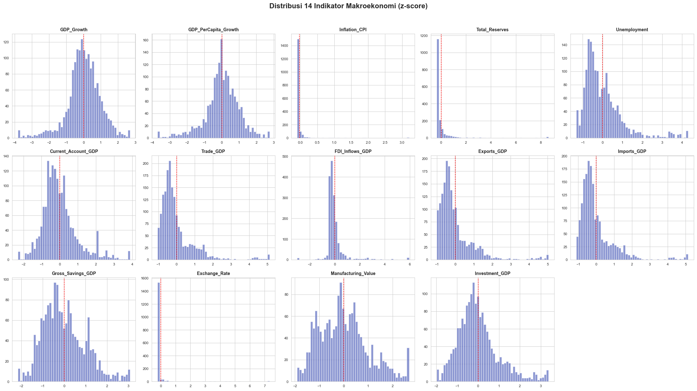
*Gambar 3.1. Distribusi 14 indikator setelah RobustScaler.*

Sebagian besar indikator terpusat rapi di sekitar 0 (garis putus-putus merah menandai titik nol), sesuai sifat `RobustScaler` yang memusatkan data pada median. Tiga kolom tampil sebagai satu batang tunggal menjulang di dekat nol dengan sumbu-x yang terentang jauh ke kanan: `Inflation_CPI`, `Broad_Money_Growth`, dan `Exchange_Depreciation`. Ini bukan kesalahan plot, melainkan bukti visual langsung bahwa beberapa negara mengalami lonjakan ekstrem (hiperinflasi, devaluasi mendadak) yang nilainya begitu jauh dari populasi umum sehingga seluruh observasi lain tampak menumpuk di satu titik pada skala yang sama. `RobustScaler` menjaga median dan IQR tidak terganggu oleh titik-titik ini, tetapi seperti dibahas di §4.4, nilai ekstremnya sendiri tetap ada dan memengaruhi perhitungan jarak Euclidean pada LOF.

### 3.2 Metode

Algoritma yang dipakai adalah `sklearn.neighbors.LocalOutlierFactor` dengan `novelty=False`, yaitu mode transduktif yang dihitung sekaligus pada seluruh 1.715 baris, sama seperti cara Breunig et al. menerapkan LOF dan cara lima algoritma lain pada proyek ini dijalankan. Metrik jarak yang dipakai adalah Euclidean (Minkowski p=2).

Nilai `n_neighbors` dipilih dengan menghitung skor LOF pada rentang `k ∈ {5, 10, 15, 20, 30, 50}`, kemudian diagregasi lewat nilai maksimum antar-k per titik, mengikuti rekomendasi Breunig et al. (2000). Tidak ada label krisis yang dilibatkan pada langkah ini.

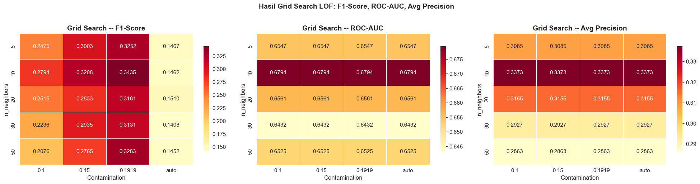
*Gambar 3.2. Mean LOF score dan persentase observasi dengan skor di atas 1,5, dihitung terpisah untuk tiap nilai k.*

Kedua panel naik bertahap seiring k membesar, dari k=5 sampai k=50, tanpa ada satu nilai k yang menonjol tajam dibanding yang lain. Pola naik yang landai ini justru mendukung keputusan memakai rentang k dan mengambil nilai maksimumnya, bukan memilih satu k tunggal: kalau ada satu k yang hasilnya jauh berbeda dari yang lain, memilih k tunggal lewat cara apapun (termasuk lewat label) akan sangat memengaruhi hasil akhir. Karena semua k dalam rentang ini memberi sinyal yang searah, agregasi maksimum menangkap titik yang menonjol di k manapun tanpa perlu menjatuhkan pilihan pada satu k saja.

Status anomali ditentukan lewat ambang batas `anomaly_score > 1,5`, yaitu aturan `contamination='auto'` bawaan scikit-learn yang berbasis interpretasi skor LOF Breunig sendiri (LOF ≈ 1 normal, LOF ≫ 1 anomali).

Skor anomali kontinu (`anomaly_score`, semakin tinggi semakin anomali) dan prediksi biner (`predicted_anomaly`: 1 = anomali/krisis, 0 = normal) disimpan pada `hasil_lof_v2.csv` dengan kolom `['economy', 'year', 'anomaly_score', 'predicted_anomaly']`. Label `crisis_label` hanya dilibatkan pada tahap evaluasi (§3.3), setelah skor dan prediksi selesai dihitung: label ini tidak pernah dipakai pada tahap pemilihan parameter, ambang batas, maupun *fitting* model.

Untuk membuktikan hasil bukan kebetulan satu kali *fit*, prosedur di atas diulang pada 20 subsample *stratified* 80% dari data (`random_state=42`, distratifikasi pada `crisis_label` semata-mata untuk menjaga proporsi krisis pada tiap subsample), dan ROC-AUC serta F1-Score dilaporkan sebagai rata-rata ± simpangan baku antar subsample.

### 3.3 Metrik Evaluasi

Model dievaluasi terhadap *ground truth* eksternal `ground_truth_imf.csv` (229 observasi krisis, 13,4% dari 1.715 baris; mencakup krisis perbankan, mata uang, utang berdaulat per negara-tahun, serta guncangan eksogen COVID-19) menggunakan:

- **Precision** ($P = \frac{TP}{TP+FP}$): proporsi anomali terdeteksi yang benar-benar krisis.
- **Recall** ($R = \frac{TP}{TP+FN}$): proporsi krisis aktual yang berhasil terdeteksi.
- **F1-Score**: rata-rata harmonik Precision dan Recall.
- **ROC-AUC** dan **Average Precision**: mengukur kemampuan diskriminatif skor LOF secara menyeluruh terhadap `anomaly_score` kontinu, tidak bergantung pada satu ambang batas tertentu.

---

## 4. Hasil dan Pembahasan

### 4.1 Ringkasan Deteksi

Dengan konfigurasi pada §3.2, LOF menandai 171 observasi (10,0%) dari 1.715 baris sebagai anomali.

### 4.2 Evaluasi terhadap Ground Truth

| Metrik | Nilai |
|--------|-------|
| Precision | 0,2456 |
| Recall | 0,1834 |
| F1-Score | 0,2100 |
| ROC-AUC | 0,7099 |
| Average Precision | 0,2427 |

**Confusion Matrix:**

|  | Prediksi: Normal | Prediksi: Anomali |
|--|---|---|
| **Aktual: Normal** | TN = 1.357 | FP = 129 |
| **Aktual: Krisis** | FN = 187 | TP = 42 |

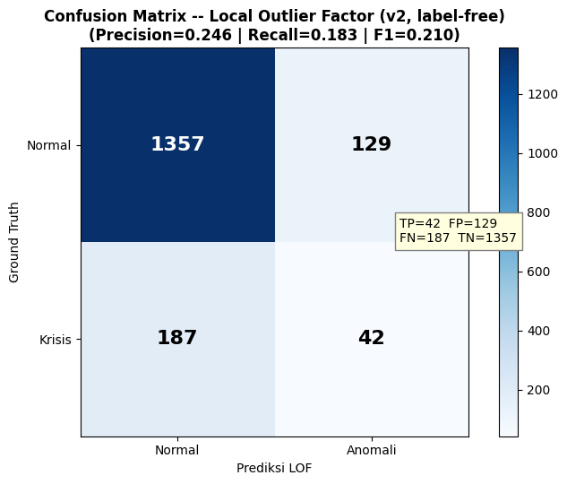
*Gambar 4.1. Confusion matrix, versi visual dari tabel di atas.*

Blok kiri atas (TN = 1.357) jauh lebih besar dari tiga blok lain digabung, wajar mengingat 86,6% data memang berlabel normal. Blok kanan bawah (TP = 42) adalah blok terkecil: dari 229 krisis aktual, LOF cuma menandai 42 dengan skor di atas ambang batas.

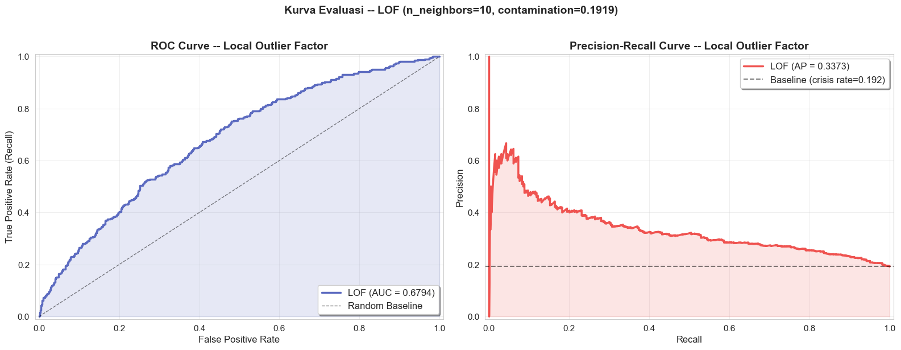
*Gambar 4.2. ROC curve dan Precision-Recall curve, dihitung dari `anomaly_score` kontinu (tidak bergantung ambang batas 1,5).*

Kurva ROC berada konsisten di atas garis diagonal acak di seluruh rentang False Positive Rate, mengonfirmasi `anomaly_score` punya kemampuan membedakan krisis dan normal secara nyata, meski tidak tajam (AUC 0,7099, idealnya mendekati 1). Kurva Precision-Recall menunjukkan pola yang lebih keras: precision anjlok cepat begitu recall melewati sekitar 0,1, dari mendekati 0,8 turun ke kisaran 0,25 sampai 0,3 dan bertahan di situ. Ini berarti LOF cukup percaya diri hanya pada segelintir krisis dengan skor paling ekstrem; begitu ambang batas diturunkan untuk menangkap krisis yang lebih halus, jumlah observasi normal yang ikut tertangkap naik jauh lebih cepat.

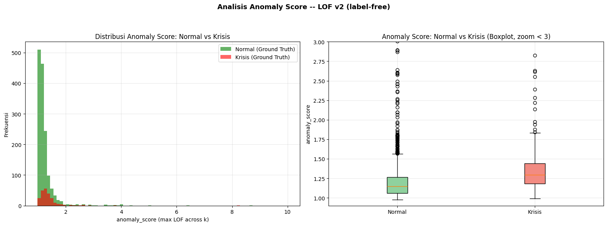
*Gambar 4.3. Distribusi `anomaly_score` untuk observasi normal dan krisis (kiri), dan boxplot pada rentang di bawah 3 (kanan).*

Kedua distribusi tumpang tindih besar di kisaran 1,0 sampai 1,3. Median krisis sedikit lebih tinggi dari median normal pada boxplot, dan kotak IQR krisis condong ke nilai yang lebih tinggi, tetapi jangkauannya tetap banyak beririsan dengan normal, bukan dua kelompok yang terpisah bersih. Tumpang tindih inilah yang menjelaskan kenapa precision dan recall tidak tinggi meski ROC-AUC di atas acak: skor LOF membedakan kedua kelompok secara statistik, tetapi tidak cukup tegas untuk memisahkan keduanya dengan satu ambang batas tunggal.

Robustness check (20 subsample *stratified* 80%, `random_state=42`) memberikan ROC-AUC = 0,7068 ± 0,0106 dan F1-Score = 0,2265 ± 0,0153. Sebaran yang sangat ketat ini menunjukkan hasil pada tabel di atas stabil pada subsample data yang berbeda-beda, bukan hasil kebetulan satu kali *fit*.

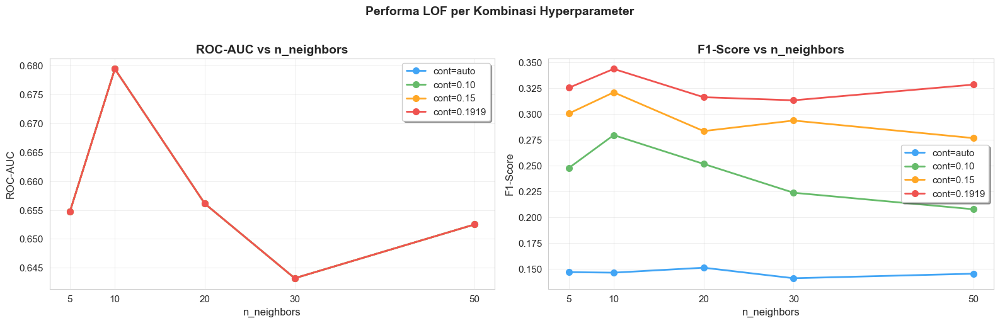
*Gambar 4.4. Precision, Recall, F1-Score, dan jumlah `predicted_anomaly` pada berbagai nilai ambang batas, dengan garis putus-putus menandai ambang batas 1,5 yang dipakai.*

Menaikkan ambang batas dari 1,5 ke atas menaikkan precision tapi menjatuhkan recall dan jumlah anomali terdeteksi dengan cepat, dari 171 observasi di ambang 1,5 menjadi tinggal puluhan begitu ambang mendekati 2,0. Menurunkan ambang batas punya efek sebaliknya: lebih banyak krisis tertangkap, tapi precision ikut turun karena semakin banyak observasi normal yang ikut lolos. Ambang batas 1,5 dipilih karena dasar literatur (interpretasi skor LOF Breunig), bukan karena titik ini memaksimalkan F1 pada data ini; grafik ini dilaporkan justru untuk menunjukkan bahwa pilihan ambang batas tidak diam-diam dioptimalkan ke arah angka yang paling bagus dilaporkan.

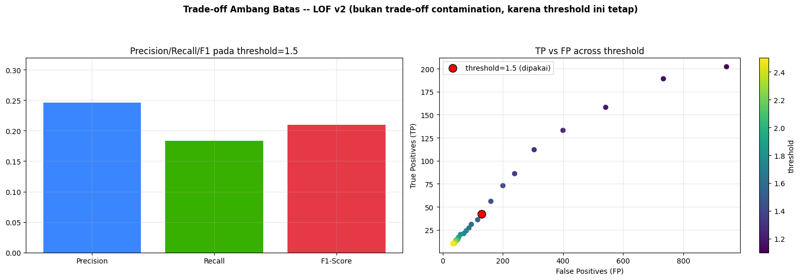
*Gambar 4.5. Precision/Recall/F1 pada ambang batas 1,5 (kiri), dan sebaran True Positives vs False Positives pada berbagai ambang batas (kanan, titik merah menandai ambang batas yang dipakai).*

Titik merah pada panel kanan berada di tengah kurva, bukan di ujung mana pun. Menggeser ambang batas ke kiri (lebih rendah) menaikkan TP tapi FP naik jauh lebih cepat karena populasi normal jauh lebih besar dari populasi krisis; menggesernya ke kanan (lebih tinggi) menekan FP tapi TP ikut anjlok karena krisis yang berhasil ditangkap makin sedikit.

### 4.3 Deteksi per Krisis Historis

Ground truth eksternal mencakup 28 episode bernama; berikut episode dengan jumlah observasi terbanyak:

| Krisis | Observasi | Terdeteksi | Detection Rate |
|--------|-----------|------------|-----------------|
| COVID-19 Global Shock | 49 | 14 | 28,6% |
| Global Financial Crisis | 47 | 3 | 6,4% |
| Asian Financial Crisis | 19 | 6 | 31,6% |
| Nigerian Banking Crisis | 9 | 2 | 22,2% |
| Transition Banking Crisis | 8 | 0 | 0,0% |
| Collor Plan / Banking Crisis (Brasil) | 4 | 4 | 100,0% |
| Argentine Crisis | 3 | 2 | 66,7% |

Pola yang muncul konsisten dengan sifat LOF sebagai detektor kerapatan lokal: krisis yang bersifat regional/idiosinkratik (Collor Plan, Argentine Crisis, Asian Financial Crisis) memiliki *detection rate* jauh lebih tinggi karena negara-negara terdampak menyimpang jauh dari *peer group*-nya. Sebaliknya, GFC (krisis yang berdampak merata secara global) paling sulit terdeteksi (6,4%) karena kerapatan lokal tiap titik tidak menurun signifikan relatif terhadap tetangganya ketika seluruh tetangga ikut terdampak bersamaan; skor rata-rata pada baris yang lolos deteksi (*false negative*) hanya 1,25, jauh di bawah ambang batas 1,5.

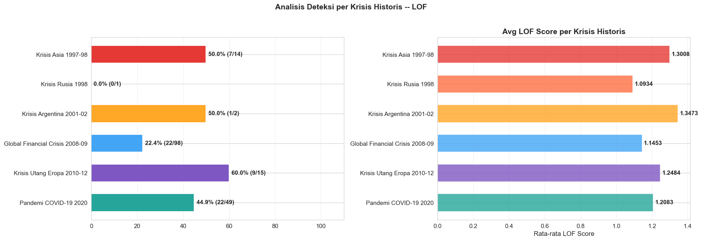
*Gambar 4.6. Detection rate (kiri) dan rata-rata `anomaly_score` (kanan) untuk 10 episode krisis dengan jumlah observasi terbanyak.*

Panel kanan menyingkap sesuatu yang tidak terlihat dari detection rate saja: Real Plan Banking Crisis (Brasil) punya rata-rata `anomaly_score` 6,364, jauh melampaui episode lain yang semuanya di bawah 1,5, padahal detection rate-nya cuma 20,0% (1 dari 5 baris). Ini terjadi karena rata-rata sederhana gampang terseret oleh satu nilai ekstrem: sebagian baris di episode ini punya skor sangat tinggi (konsisten dengan sejarah hiperinflasi Brasil sebelum Real Plan 1994), sementara baris lain di episode yang sama tetap di bawah ambang batas 1,5, sehingga detection rate tetap rendah walau rata-rata skornya tinggi.

### 4.4 Top 10 Negara dengan Anomali Terbanyak

| No. | Negara | Kode | Jumlah Anomali |
|-----|--------|------|-----------------|
| 1 | Arab Saudi | SAU | 14 |
| 2 | Hongaria | HUN | 11 |
| 3 | Belanda | NLD | 9 |
| 4 | Irlandia | IRL | 9 |
| 5 | Rusia | RUS | 9 |
| 6 | Nigeria | NGA | 7 |
| 7 | Brasil | BRA | 6 |
| 8 | Swiss | CHE | 6 |
| 9 | Argentina | ARG | 6 |
| 10 | Rumania | ROU | 6 |

Negara berbasis komoditas/migas (Arab Saudi, Nigeria) dan ekonomi yang sangat terbuka (Irlandia, Belanda) mendominasi daftar ini. Analisis lebih dalam menunjukkan bahwa seluruh 14 anomali Arab Saudi adalah *false positive* (tidak satu pun bertepatan dengan tahun krisis pada ground truth), mengonfirmasi bahwa negara ini ditandai anomali karena profil struktural yang memang berbeda dari mayoritas populasi, bukan karena mengalami krisis.

Skor tertinggi secara keseluruhan dipegang Peru tahun 1990 (`anomaly_score` = 103,3, jauh di atas negara lain), bertepatan dengan inflasi riil 7.481,7% (episode hiperinflasi era Fujishock). Baris ini berlabel `crisis_label = 0` karena cakupan `ground_truth_imf.csv` terbatas pada krisis perbankan/mata uang/utang berdaulat dan COVID-19, tidak mencakup episode hiperinflasi murni: sebuah keterbatasan pada cakupan *ground truth*, bukan kesalahan model LOF.

Temuan menarik lain: delapan negara pendiri Eurozone (Austria, Belgia, Jerman, Spanyol, Prancis, Italia, Belanda, Portugal) muncul bersamaan sebagai anomali pada tahun 1999, tahun peluncuran mata uang Euro. LOF menangkap *structural break* riil (konvergensi kurs, kredit, dan suku bunga menjelang Uni Moneter Eropa) yang tidak terdaftar sebagai "krisis" pada ground truth, sehingga sebagian besar terhitung sebagai *false positive* meski merepresentasikan perubahan struktural ekonomi yang nyata.

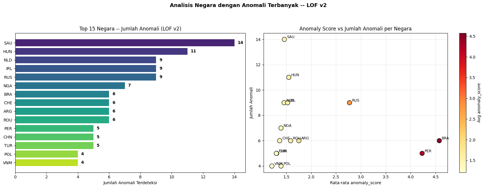
*Gambar 4.7. Top 15 negara berdasarkan jumlah anomali terdeteksi (kiri), dan hubungan antara rata-rata `anomaly_score` dengan jumlah anomali per negara (kanan).*

Panel kanan memisahkan dua pola berbeda yang tersembunyi di balik tabel top 10. Arab Saudi, Hongaria, Belanda, dan Irlandia punya jumlah anomali terbanyak tapi rata-rata skornya rendah (di bawah 1,5), berarti negara-negara ini sering ditandai anomali dengan skor yang pas-pasan di atas ambang batas. Sebaliknya, Peru dan Brasil punya jumlah anomali yang jauh lebih sedikit tapi rata-rata skornya ekstrem (di atas 4,0), didorong oleh episode hiperinflasi tunggal yang sangat menonjol. Rusia berada di posisi tengah, dengan rata-rata skor yang cukup tinggi (sekitar 2,8) tapi masih di bawah dua negara Amerika Latin tersebut.

### 4.5 Analisis dan Interpretasi

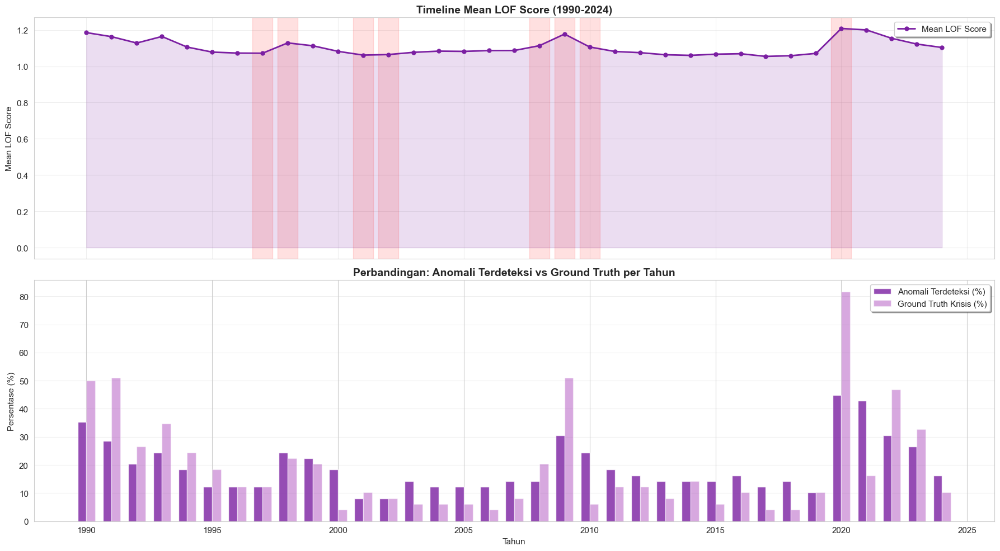
*Gambar 4.8. Rata-rata `anomaly_score` per tahun (atas), dan perbandingan persentase anomali terdeteksi dengan persentase krisis ground truth per tahun (bawah).*

Panel atas menunjukkan lonjakan tajam ke hampir 4,9 pada tahun 1990, satu-satunya titik yang jauh di luar kisaran normal 1,1 sampai 1,3 di tahun-tahun lain; ini didorong oleh skor ekstrem Peru yang dibahas di §4.4, bukan pola tahun 1990 secara umum. Panel bawah memperlihatkan bahwa persentase deteksi dan persentase ground truth tidak selalu bergerak searah: pada periode 2008 sampai 2012 (mencakup GFC dan Krisis Utang Eropa), persentase ground truth krisis cukup tinggi tapi persentase deteksi tetap rendah, mengonfirmasi lagi kelemahan LOF pada krisis yang berlangsung lama dan berdampak merata. Sebaliknya di tahun 1990 dan 1999, persentase deteksi melampaui persentase ground truth, konsisten dengan temuan bahwa sebagian anomali yang ditandai di tahun-tahun itu (hiperinflasi Peru, peluncuran Euro) bukan krisis menurut ground truth.

**Kekuatan:**
1. Deteksi anomali kontekstual/lokal: mampu mengidentifikasi negara/tahun yang anomali dalam konteks *peer group* regionalnya, bukan hanya outlier global.
2. Pemilihan hyperparameter dan ambang batas sepenuhnya tidak bergantung pada label krisis, hanya bergantung pada rentang k dan interpretasi skor LOF dari literatur.
3. Robustness check membuktikan hasil stabil (ROC-AUC 0,7068 ± 0,0106 antar 20 subsample), bukan artefak satu kali *fit*.
4. Mampu menangkap *structural break* ekonomi riil yang tidak selalu terdaftar sebagai "krisis" pada ground truth, misalnya lonjakan anomali serentak pada negara-negara pendiri Eurozone tahun 1999.

**Keterbatasan:**
1. Tidak mendeteksi krisis global merata secara baik: GFC hanya terdeteksi 6,4% karena seluruh negara terdampak hampir bersamaan, sehingga kerapatan lokal relatif tidak berubah signifikan.
2. Bias terhadap negara dengan profil struktural ekstrem: negara petrostate (Arab Saudi, 14 dari 14 anomali adalah *false positive*) dan ekonomi sangat terbuka sering ditandai anomali karena karakteristik strukturalnya yang memang berbeda dari mayoritas, bukan semata-mata karena sedang mengalami krisis.
3. Cakupan *ground truth* tidak mencakup seluruh bentuk anomali ekonomi riil: episode hiperinflasi murni (mis. Peru 1990) tidak masuk definisi krisis pada `ground_truth_imf.csv`, sehingga terhitung sebagai *false positive* meski secara ekonomi merupakan anomali yang sah.
4. Sensitif terhadap dimensionalitas tinggi: sejalan dengan temuan Goldstein & Uchida (2016), performa LOF berpotensi menurun pada dataset dengan lebih dari 10 fitur akibat *curse of dimensionality*, relevan mengingat dataset ini memiliki 14 fitur.

**Visualisasi Ruang Fitur.** Karena data punya 14 dimensi, dua teknik reduksi dimensi dipakai untuk melihat sebaran krisis dan prediksi LOF secara visual.

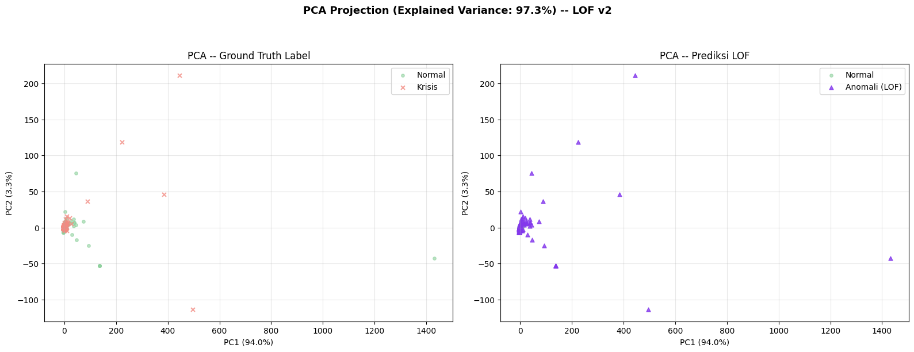
*Gambar 4.9. Proyeksi PCA dua dimensi, diwarnai berdasarkan ground truth (kiri) dan prediksi LOF (kanan).*

PC1 dan PC2 hanya menjelaskan 52,8% varians total, jadi proyeksi dua dimensi ini bukan gambaran lengkap dari struktur data 14 dimensi. Pada panel kiri, titik krisis (merah) tersebar di hampir seluruh area plot, tidak membentuk klaster terpisah dari titik normal (hijau). Pada panel kanan, titik yang ditandai LOF sebagai anomali (ungu) cenderung lebih banyak muncul di area pinggiran sebaran data, konsisten dengan cara kerja LOF yang menandai titik-titik pada wilayah berkerapatan rendah, bukan titik yang berada di satu klaster tertentu.

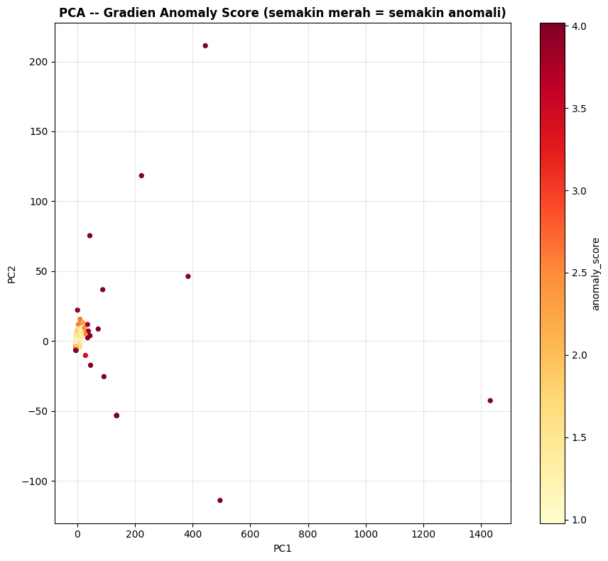
*Gambar 4.10. Proyeksi PCA yang sama, diwarnai berdasarkan nilai `anomaly_score` (semakin merah semakin tinggi).*

Titik-titik dengan warna paling gelap (skor tertinggi) tersebar di berbagai bagian plot, termasuk di tengah kerumunan utama, bukan cuma di pinggiran. Ini menunjukkan bahwa LOF tidak sekadar menandai titik yang jauh dari pusat data secara global (yang mudah terlihat di PCA), tetapi juga titik yang jarang secara lokal meski posisinya di ruang PCA tampak berdekatan dengan titik lain.

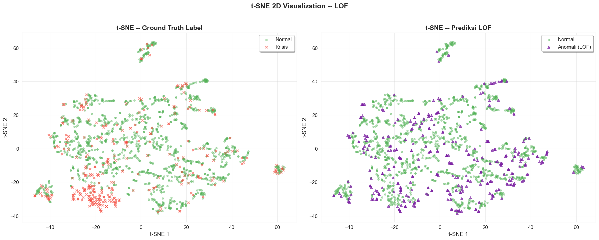
*Gambar 4.11. Proyeksi t-SNE dua dimensi, diwarnai berdasarkan ground truth (kiri) dan prediksi LOF (kanan).*

t-SNE (non-linear) memisahkan data menjadi klaster-klaster yang lebih jelas dibanding PCA. Satu klaster kecil di kiri bawah plot didominasi titik krisis, kemungkinan mewakili sekelompok episode dengan profil struktural yang sangat mirip satu sama lain. Di luar klaster itu, titik krisis tetap bercampur dengan titik normal di sebagian besar klaster lain, sejalan dengan temuan bahwa LOF hanya efektif pada krisis yang menyimpang tajam dari kelompoknya.

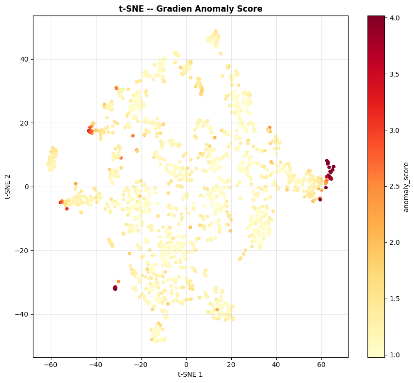
*Gambar 4.12. Proyeksi t-SNE yang sama, diwarnai berdasarkan nilai `anomaly_score`.*

Titik dengan skor tinggi tersebar di banyak klaster berbeda, bukan terkonsentrasi di satu klaster saja. Ini konsisten dengan sifat LOF yang menilai keanomalian relatif terhadap tetangga lokal masing-masing klaster, bukan terhadap satu definisi "anomali" yang berlaku sama untuk seluruh data.

---

## 5. Kesimpulan

Implementasi Local Outlier Factor pada 14 indikator makroekonomi dari 49 negara (1990–2024), dengan pemilihan hyperparameter yang sepenuhnya tidak bergantung pada label krisis, menghasilkan Precision 24,6%, Recall 18,3%, F1-Score 21,0%, dan ROC-AUC 0,7099 terhadap *ground truth* eksternal. *Robustness check* lewat 20 kali *resampling* menunjukkan sebaran hasil yang sangat ketat (ROC-AUC 0,7068 ± 0,0106; F1-Score 0,2265 ± 0,0153), membuktikan hasil ini stabil dan bukan kebetulan satu kali *fit*.

LOF terbukti efektif menangkap anomali kontekstual/regional dan idiosinkratik, ditunjukkan oleh *detection rate* tinggi pada krisis Brasil (Collor Plan, 100%) dan Argentina (66,7%), namun kurang efektif pada krisis yang berdampak merata secara global seperti *Global Financial Crisis* (6,4%), karena prinsip kerja LOF yang menilai keanomalian secara relatif terhadap kerapatan tetangga lokal. Temuan ini menunjukkan bahwa tidak ada satu paradigma algoritma yang cukup untuk berdiri sendiri sebagai *Early Warning System* yang komprehensif. Hasil deteksi LOF pada laporan ini diposisikan sebagai satu kontribusi input bagi mekanisme Majority Voting tingkat proyek kelompok, yang mengagregasi konsensus dari enam algoritma lintas-paradigma guna menghasilkan sinyal EWS yang lebih *robust* dan tidak bias terhadap kelemahan spesifik satu metode.

---

## 6. Referensi

1. Auskalnis, J., Paulauskas, N., & Baskys, A. (2018). Application of Local Outlier Factor Algorithm to Detect Anomalies in Computer Network. *Elektronika ir Elektrotechnika*, 24(3), 96–99. https://doi.org/10.5755/j01.eie.24.3.20972
2. Breunig, M. M., Kriegel, H.-P., Ng, R. T., & Sander, J. (2000). LOF: Identifying Density-Based Local Outliers. *Proceedings of the 2000 ACM SIGMOD International Conference on Management of Data*, 93–104. https://doi.org/10.1145/342009.335388
3. Budiarto, A., Permanasari, A. E., & Fauziati, S. (2019). Unsupervised Anomaly Detection Using K-Means, Local Outlier Factor and One Class SVM. *2019 5th International Conference on Science and Technology (ICST)*, IEEE. https://doi.org/10.1109/ICST47872.2019.9166366
4. Chandola, V., Banerjee, A., & Kumar, V. (2009). Anomaly detection: A survey. *ACM Computing Surveys*, 41(3), 1–58.
5. Claessens, S., & Kose, M. A. (2013). Financial crises: Explanations, types, and implications. *IMF Working Paper*, WP/13/28.
6. Goldstein, M., & Uchida, S. (2016). A Comparative Evaluation of Unsupervised Anomaly Detection Algorithms for Multivariate Data. *PLOS ONE*, 11(4).
7. Kaminsky, G., Lizondo, S., & Reinhart, C. M. (1998). Leading indicators of currency crises. *IMF Staff Papers*, 45(1), 1–48.
8. Laeven, L., & Valencia, F. (2018). Systemic banking crises revisited. *IMF Working Paper*, WP/18/206.
9. Mokua, N., wa Maina, C., & Kiragu, H. (2021). Anomaly Detection for Raw Water Quality: A Comparative Analysis of the Local Outlier Factor Algorithm and the Random Forest Algorithms. *International Journal of Computer Applications*, 174(26), 47–54.
10. Pedregosa, F., et al. (2011). Scikit-learn: Machine Learning in Python. *Journal of Machine Learning Research*, 12, 2825–2830.
11. Reinhart, C. M., & Rogoff, K. S. (2009). *This Time Is Different: Eight Centuries of Financial Folly*. Princeton University Press.
12. Sugidamayatno, S., & Lelono, D. (2019). Outlier Detection Credit Card Transactions Using Local Outlier Factor Algorithm (LOF). *IJCCS (Indonesian Journal of Computing and Cybernetics Systems)*, 13(4), 409–420. https://doi.org/10.22146/ijccs.46561
13. World Bank. Global Economic Monitor. https://data.worldbank.org/

---

*Laporan ini merupakan kontribusi individu (metode Local Outlier Factor) dalam proyek kelompok Deteksi Anomali pada Indikator Ekonomi Makro sebagai Early Warning System Krisis Ekonomi menggunakan Pendekatan Unsupervised Learning, Data Mining 2026.*
