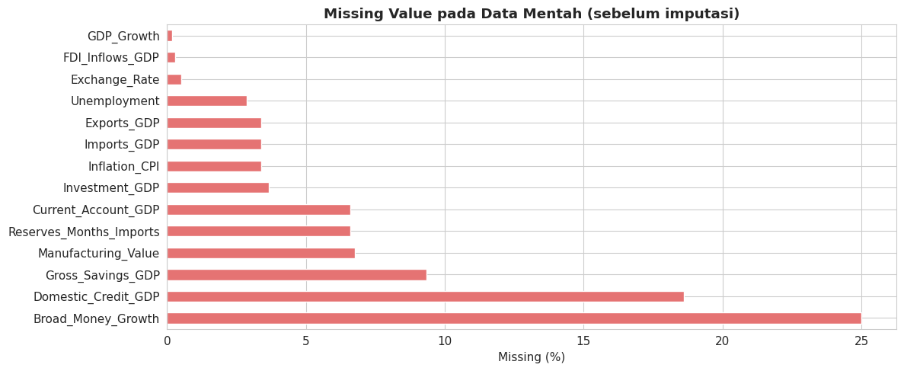
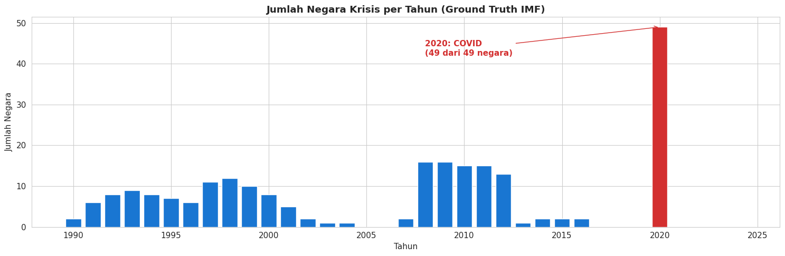
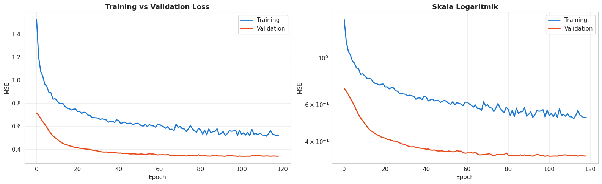
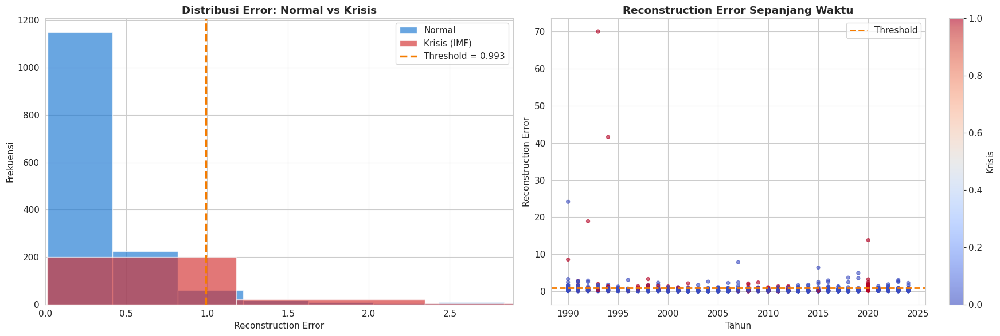
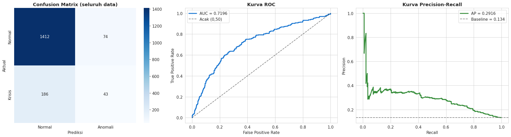
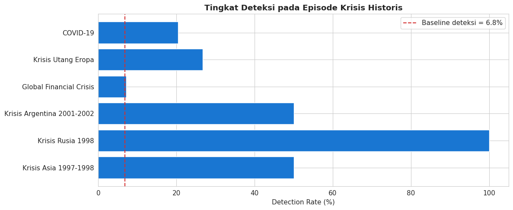
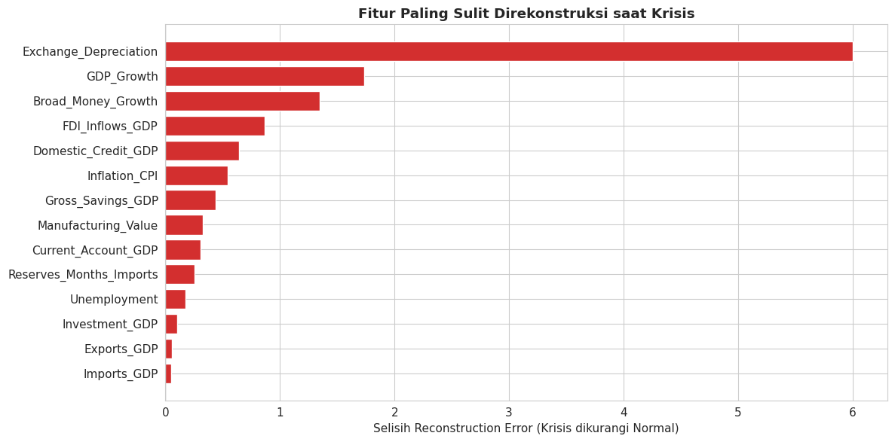

# Deteksi Anomali Indikator Makroekonomi Global Menggunakan Autoencoder

**Laporan Implementasi Model — Early Warning System Krisis Ekonomi**

Kelompok 4 — Kelas 3SI1 | Mata Kuliah Data Mining

Disusun oleh: **Deka** (Autoencoder)

---

## Abstrak

Laporan ini memaparkan implementasi *Autoencoder* sebagai salah satu dari enam algoritma deteksi anomali dalam proyek *Early Warning System* krisis ekonomi. Model dilatih pada panel seimbang 49 negara selama periode 1990 sampai 2024, mencakup 1.715 observasi negara-tahun dengan 14 indikator makroekonomi.

Berbeda dari implementasi awal, versi ini memakai ground truth eksternal dari basis data krisis IMF Laeven dan Valencia, bukan label yang diturunkan sendiri dari variabel input. Model mencapai AUC-ROC sebesar 0,720 dengan precision 0,368 dan recall 0,188.

Kontribusi utama laporan ini bukan semata angka performa, melainkan perbaikan enam kekeliruan metodologis yang membuat hasil versi sebelumnya tidak sahih. Perbaikan paling berdampak adalah transformasi nilai tukar dan penghapusan bias struktural antar negara.

---

## 1. Pendahuluan

### 1.1 Latar Belakang

Krisis ekonomi jarang datang tanpa jejak. Indikator makroekonomi umumnya menunjukkan penyimpangan pola sebelum dan selama krisis berlangsung. Persoalannya, penyimpangan tersebut sulit dikenali dengan aturan ambang batas tetap karena setiap negara memiliki struktur ekonomi yang berbeda.

Pendekatan deteksi anomali menawarkan jalan keluar. Model belajar mengenali pola normal, lalu menandai observasi yang menyimpang dari pola tersebut tanpa memerlukan definisi krisis yang kaku di awal.

### 1.2 Posisi Autoencoder dalam Penelitian

Autoencoder dipilih sebagai wakil paradigma *deep learning* dalam perbandingan enam algoritma. Keunggulannya terletak pada kemampuan menangkap hubungan non-linear antar indikator, sesuatu yang sulit dilakukan metode berbasis jarak atau kepadatan.

Cara kerjanya sederhana secara konsep. Model dilatih memampatkan 14 indikator menjadi representasi berdimensi rendah, lalu merekonstruksinya kembali. Observasi yang sulit direkonstruksi, ditandai oleh *reconstruction error* tinggi, dianggap menyimpang dari pola normal.

### 1.3 Catatan Kejujuran Metodologis

Satu hal perlu dinyatakan sejak awal. Autoencoder dalam penelitian ini **bukan** metode *unsupervised* murni. Model dilatih hanya pada observasi non-krisis, sehingga informasi label ikut digunakan.

Istilah yang tepat adalah ***semi-supervised novelty detection***. Penyebutan ini penting agar konsisten dengan klaim pada bab pendahuluan, dan agar pembaca memahami bahwa Autoencoder, One-Class SVM, dan PCA tidak berada pada kondisi yang setara dengan DBSCAN yang benar-benar tidak memakai label.

---

## 2. Data dan Metodologi

### 2.1 Sumber Data

| Aspek | Keterangan |
|-------|------------|
| Sumber indikator | World Bank Open Data |
| Sumber label krisis | IMF Laeven dan Valencia (2018) |
| Unit observasi | Pasangan negara-tahun |
| Jumlah observasi | 1.715 (49 negara x 35 tahun) |
| Periode | 1990 sampai 2024 |
| Jumlah fitur | 14 indikator makroekonomi |
| Proporsi krisis | 229 observasi (13,35 persen) |

Panel bersifat seimbang, artinya setiap negara memiliki tepat 35 baris tanpa ada observasi yang dibuang.

### 2.2 Kondisi Data Mentah

Sebelum imputasi, sebagian variabel memiliki tingkat ketidaklengkapan yang cukup tinggi.



**Gambar 1.** Persentase *missing value* per kolom pada data mentah sebelum imputasi.

Dua variabel perlu mendapat perhatian khusus dalam interpretasi hasil. `Broad_Money_Growth` memiliki 25,01 persen nilai kosong dan `Domestic_Credit_GDP` sebesar 18,60 persen. Proporsi sebesar itu berarti sebagian nilai pada kedua variabel merupakan hasil imputasi, bukan pengamatan asli.

### 2.3 Rekayasa Fitur

#### 2.3.1 Transformasi Nilai Tukar

Ini perbaikan paling menentukan dalam keseluruhan revisi.

Versi awal memasukkan nilai tukar dalam satuan mata uang lokal per dolar AS. Nilai semacam ini tidak dapat dibandingkan antar negara karena hanya mencerminkan denominasi mata uang, bukan kondisi ekonomi.

| Negara | Median nominal | Kondisi sebenarnya |
|--------|----------------|--------------------|
| Inggris | 0,64 per USD | Normal |
| Irlandia | 0,80 per USD | Normal |
| Indonesia | 9.387 per USD | Normal |
| Vietnam | 16.105 per USD | Normal dan stabil |

Rasio antara nilai tertinggi dan terendah mencapai 25.127 kali lipat. Setelah distandarisasi secara global, Vietnam dan Indonesia memperoleh skor ekstrem dan terbaca sebagai krisis permanen, padahal nilai tukar kedua negara relatif stabil.

Perbaikannya mengikuti praktik baku pada literatur krisis mata uang, yaitu memakai laju depresiasi tahunan:

```
Exchange_Depreciation(i,t) = (E(i,t) - E(i,t-1)) / E(i,t-1) x 100
```

#### 2.3.2 Cadangan Devisa

Masalah serupa pernah terjadi pada cadangan devisa yang semula dinyatakan dalam nominal dolar AS. Perbandingan antara cadangan Tiongkok dan Kenya menjadi tidak bermakna karena selisih skalanya sangat besar.

Pada berkas data terbaru, variabel ini sudah berbentuk `Reserves_Months_Imports`, yaitu cadangan devisa dinyatakan dalam satuan bulan impor, dengan rentang 0,03 hingga 37,37 bulan.

#### 2.3.3 Imputasi

Imputasi dilakukan bertingkat dan selalu dalam lingkup negara masing-masing agar tren waktu tiap negara terjaga. Urutannya adalah interpolasi linear per negara, lalu pengisian dengan median negara, dan terakhir median global sebagai pengaman.

### 2.4 Penskalaan dan Penghapusan Bias Struktural

Standardisasi global membandingkan level struktural antar negara, bukan kondisi krisisnya. Akibatnya cukup serius pada versi awal.

Singapura memiliki rasio perdagangan terhadap PDB di atas 300 persen karena berperan sebagai pusat perdagangan. Karakter itu bersifat permanen, bukan tanda krisis. Namun model versi awal menandainya sebagai anomali pada **35 dari 35 tahun**.

Solusinya adalah mengurangi setiap nilai dengan rata-rata negaranya sendiri sebelum standardisasi global. Dengan cara ini setiap negara dinilai relatif terhadap kondisi normalnya sendiri, sementara skala antar fitur tetap sebanding.

Empat skema diuji secara empiris menggunakan PCA sebagai proksi:

| Skema penskalaan | AUC konkuren | AUC lead 1 tahun |
|------------------|--------------|------------------|
| Global murni | 0,6401 | 0,5573 |
| Robust scaler | 0,6135 | 0,5205 |
| Z-score per negara | 0,6341 | 0,5363 |
| **Demeaning lalu global** | **0,6676** | **0,5872** |

Skema demeaning unggul pada kedua horizon sehingga dipilih untuk implementasi akhir.

### 2.5 Ground Truth

Versi awal membentuk label krisis melalui aturan bertingkat atas empat variabel yang juga menjadi masukan model. Hal ini menimbulkan penalaran melingkar, karena model dinilai berdasarkan aturan yang disusun dari variabel yang sama.

Versi revisi memakai label eksternal dari IMF Laeven dan Valencia yang mencakup krisis perbankan, krisis mata uang, dan krisis utang pemerintah.



**Gambar 2.** Sebaran jumlah negara yang mengalami krisis per tahun menurut ground truth IMF. Batang merah menandai tahun 2020.

Sebaran ini sesuai dengan catatan sejarah. Puncak terlihat pada periode Krisis Asia tahun 1997 hingga 1999, Krisis Keuangan Global tahun 2008 hingga 2012, serta tahun 2020.

**Temuan penting mengenai tahun 2020.** Seluruh 49 negara dilabeli krisis pada tahun tersebut, tetapi ketiga komponen krisis bernilai nol. Label berasal dari kategori "COVID-19 Global Shock" yang berada di luar taksonomi Laeven dan Valencia. Tahun ini menyumbang 49 dari 229 observasi krisis, atau sekitar 21 persen dari seluruh label positif. Karena itu laporan menyertakan uji sensitivitas tanpa tahun 2020.

### 2.6 Arsitektur Model

Arsitektur mengikuti pola *encoder*, *bottleneck*, lalu *decoder*:

```
Input (14 fitur)
  Dense 32 + BatchNorm + LeakyReLU(0,1) + Dropout(0,2)
  Dense 16 + BatchNorm + LeakyReLU(0,1) + Dropout(0,2)
  Bottleneck: Dense 6 (ReLU)
  Dense 16 + BatchNorm + LeakyReLU(0,1) + Dropout(0,2)
  Dense 32 + BatchNorm + LeakyReLU(0,1) + Dropout(0,2)
Output (14 fitur)
```

Rasio kompresi 14 berbanding 6, atau sekitar 2,3 kali. Fungsi kerugian memakai *Mean Squared Error* dengan optimizer Adam pada laju pembelajaran 0,001. Seed dikunci pada nilai 42 sesuai standar kelompok.

### 2.7 Pembagian Data dan Pencegahan Kebocoran

Data normal dibagi menjadi 70 persen latih, 15 persen validasi, dan 15 persen uji. Seluruh observasi krisis dialokasikan ke himpunan uji.

| Himpunan | Jumlah | Komposisi |
|----------|--------|-----------|
| Latih | 1.040 | Hanya observasi normal |
| Validasi | 223 | Hanya observasi normal |
| Uji | 452 | 229 krisis dan 223 normal |

Dua langkah diterapkan untuk mencegah kebocoran data. Pertama, terdapat pemeriksaan otomatis yang memastikan tidak ada observasi krisis masuk ke data latih. Kedua, ambang batas dikalibrasi pada persentil ke-95 *reconstruction error* **data latih saja**, bukan dari keseluruhan data.

---

## 3. Hasil

### 3.1 Proses Pelatihan



**Gambar 3.** Kurva *loss* pada skala biasa dan skala logaritmik.

Pelatihan berhenti pada epoch 119 melalui mekanisme *early stopping*, dengan bobot terbaik dipulihkan dari epoch 99. Nilai akhir *train loss* sebesar 0,521 dan *validation loss* sebesar 0,341.

Kedua kurva menurun mulus tanpa tanda divergensi, yang menunjukkan tidak terjadi *overfitting*.

**Catatan mengenai posisi kurva.** *Validation loss* berada di bawah *train loss* sepanjang pelatihan. Kondisi ini normal dan bukan indikasi kesalahan, karena lapisan Dropout dan BatchNormalization aktif saat pelatihan tetapi nonaktif saat evaluasi.

### 3.2 Distribusi Reconstruction Error



**Gambar 4.** Distribusi *reconstruction error* untuk kelompok normal dan krisis, serta sebarannya sepanjang waktu.

Ambang batas ditetapkan pada nilai 0,9933. Dari 1.715 observasi, sebanyak 117 atau 6,8 persen ditandai sebagai anomali.

Pemisahan antara kedua kelompok terlihat nyata meski bertumpang tindih. Rata-rata skor kelompok krisis mencapai 1,274 dibanding 0,356 pada kelompok normal, atau sekitar 3,6 kali lipat lebih tinggi.

### 3.3 Evaluasi Performa



**Gambar 5.** *Confusion matrix*, kurva ROC, dan kurva *Precision-Recall* pada seluruh data.

| Metrik | Seluruh Data | Data Uji Saja | Tanpa 2020 |
|--------|--------------|---------------|------------|
| Precision | 0,368 | 0,796 | 0,308 |
| Recall | 0,188 | 0,188 | 0,183 |
| F1-Score | 0,249 | 0,304 | 0,230 |
| AUC-ROC | **0,720** | 0,725 | 0,686 |
| AUC-PR | 0,292 | 0,708 | 0,225 |

Rincian *confusion matrix* pada seluruh data menunjukkan 43 *true positive*, 74 *false positive*, 186 *false negative*, dan 1.412 *true negative*.

**Peringatan dalam membaca metrik data uji.** Nilai precision sebesar 0,796 tampak mengesankan, tetapi angka tersebut merupakan akibat komposisi data, bukan cerminan kemampuan model. Himpunan uji berisi 50,7 persen observasi krisis, sementara data penuh hanya 13,35 persen. Basis kelas yang jauh lebih tinggi membuat precision otomatis naik.

Hal serupa berlaku pada AUC-PR data uji sebesar 0,708 dengan garis dasar 0,507, dibanding data penuh sebesar 0,292 dengan garis dasar 0,134.

Metrik yang sah dibandingkan antar himpunan adalah AUC-ROC karena relatif tidak terpengaruh proporsi kelas. Nilainya 0,720 pada seluruh data dan 0,725 pada data uji. Kedekatan kedua angka menegaskan model tidak mengalami *overfitting*.

**Karena itu, angka yang dilaporkan sebagai hasil utama adalah metrik pada seluruh data.**

### 3.4 Validasi terhadap Episode Krisis Historis



**Gambar 6.** Tingkat deteksi pada enam episode krisis besar.

| Episode | Jumlah observasi | Terdeteksi | Tingkat deteksi |
|---------|------------------|-----------|-----------------|
| Krisis Rusia 1998 | 1 | 1 | 100,0 persen |
| Krisis Asia 1997-1998 | 10 | 5 | 50,0 persen |
| Krisis Argentina 2001-2002 | 2 | 1 | 50,0 persen |
| Krisis Utang Eropa | 15 | 4 | 26,7 persen |
| COVID-19 | 49 | 10 | 20,4 persen |
| Krisis Keuangan Global | 98 | 7 | 7,1 persen |

**Krisis Rusia 1998 kini terdeteksi**, padahal versi awal gagal sepenuhnya dengan tingkat deteksi nol persen. Penyebab keberhasilan ini terlihat jelas pada data:

| Tahun | Depresiasi (persen) | Pertumbuhan PDB | Inflasi | Skor anomali |
|-------|--------------------|-----------------|---------|--------------|
| 1997 | 12,97 | 1,4 | 14,76 | 0,51 |
| 1998 | **67,77** | -5,3 | 27,69 | 1,02 |
| 1999 | **153,68** | 6,4 | 85,75 | 1,46 |

Versi awal memakai nilai tukar nominal sehingga lonjakan depresiasi rubel tidak terbaca sama sekali. Setelah variabel diubah menjadi laju depresiasi, krisis ini langsung tertangkap. Ini bukti langsung bahwa perbaikan rekayasa fitur menyelesaikan persoalan nyata.

Perlu dicatat bahwa angka 100 persen pada Rusia hanya berbasis satu observasi sehingga tidak dapat digeneralisasi.

### 3.5 Kontribusi Fitur



**Gambar 7.** Selisih *reconstruction error* tiap fitur antara kelompok krisis dan normal.

| Peringkat | Fitur | Selisih error |
|-----------|-------|---------------|
| 1 | Exchange_Depreciation | 6,005 |
| 2 | GDP_Growth | 1,732 |
| 3 | Broad_Money_Growth | 1,345 |
| 4 | FDI_Inflows_GDP | 0,868 |
| 5 | Domestic_Credit_GDP | 0,640 |

Depresiasi nilai tukar menjadi penanda krisis terkuat dengan selisih jauh di atas fitur lainnya. Temuan ini sejalan dengan literatur krisis mata uang, sekaligus menegaskan bahwa variabel yang semula salah bentuk justru merupakan variabel paling informatif setelah diperbaiki.

Namun dominasi tersebut perlu dibaca dengan hati-hati. Fitur ini memiliki rentang nilai sangat lebar pada kasus hiperinflasi, sehingga sebagian keunggulannya berasal dari skala, bukan semata daya pisahnya.

### 3.6 Observasi dengan Skor Tertinggi

| Negara | Tahun | Skor | Label | Keterangan |
|--------|-------|------|-------|------------|
| Brasil | 1993 | 70,06 | Krisis | Collor Plan / Banking Crisis |
| Brasil | 1994 | 41,64 | Krisis | Real Plan Banking Crisis |
| Peru | 1990 | 24,19 | Normal | Hiperinflasi 7.482 persen |
| Brasil | 1992 | 18,93 | Krisis | Collor Plan / Banking Crisis |
| Hungaria | 2020 | 13,83 | Krisis | COVID-19 |
| Brasil | 1990 | 8,57 | Krisis | Collor Plan / Banking Crisis |

Enam dari sepuluh anomali tertinggi merupakan krisis berlabel. Model berhasil mengurutkan kasus paling ekstrem pada posisi teratas.

---

## 4. Pembahasan

### 4.1 Analisis False Positive

Dari 74 *false positive*, penelusuran menunjukkan sebagian besar bukan kesalahan acak melainkan peristiwa ekonomi nyata yang tidak tercatat sebagai krisis perbankan.

**Peru tahun 1990** memiliki inflasi sebesar 7.482 persen. Ini hiperinflasi paling parah dalam seluruh dataset, namun tidak tercatat sebagai krisis perbankan sistemik.

**Irlandia tahun 2015** mencatat pertumbuhan PDB sebesar 24,6 persen dengan arus FDI mencapai 74,8 persen terhadap PDB. Peristiwa ini dikenal sebagai distorsi statistik akibat relokasi aset perusahaan multinasional, bukan pertumbuhan riil.

**Belanda tahun 2007** mengalami lonjakan FDI hingga 86,0 persen terhadap PDB.

**Arab Saudi** menyumbang 16 *false positive*, jumlah terbesar dari satu negara. Volatilitas fiskalnya jauh melampaui negara lain:

| Fitur | Simpangan baku Saudi | Median negara lain | Rasio |
|-------|---------------------|--------------------|-------|
| Reserves_Months_Imports | 12,80 | 1,42 | 9,0 kali |
| Current_Account_GDP | 12,68 | 2,73 | 4,6 kali |
| Gross_Savings_GDP | 11,55 | 2,73 | 4,2 kali |

Tahun yang ditandai mengikuti Perang Teluk dan siklus harga minyak, bukan krisis perbankan.

Temuan ini mengubah cara membaca *false positive*. Sebagian besar merupakan guncangan makroekonomi sungguhan yang berada di luar cakupan definisi ground truth. Dengan kata lain, ini keterbatasan cakupan label, bukan sepenuhnya kegagalan model.

### 4.2 Kemampuan Peringatan Dini

| Horizon | AUC-ROC |
|---------|---------|
| Konkuren, tahun t ke t | 0,720 |
| Lead 1 tahun | 0,625 |
| Lead 2 tahun | 0,596 |

Kemampuan prediksi menurun seiring bertambahnya horizon. Model lebih tepat disebut pendeteksi tekanan yang sedang berlangsung daripada sistem peringatan dini penuh.

**Meski demikian, terdapat sinyal pra-krisis yang nyata.**

| Kondisi | Rata-rata skor |
|---------|----------------|
| Tahun tenang | 0,344 |
| Satu tahun sebelum krisis | 0,488 |
| Saat krisis berlangsung | 1,274 |

Selisih antara tahun tenang dan tahun sebelum krisis diuji dengan uji Mann-Whitney U dan hasilnya **signifikan secara statistik dengan nilai p sebesar 0,0046**. Artinya tekanan makroekonomi memang mulai terbaca sebelum krisis meletus, hanya saja belum cukup kuat untuk melewati ambang batas deteksi.

Temuan ini memberi dasar empiris bahwa pendekatan tersebut memiliki potensi peringatan dini, walaupun implementasi saat ini belum mengoptimalkannya.

### 4.3 Kelemahan pada Deteksi Krisis Global Serentak

Krisis Keuangan Global menjadi episode dengan tingkat deteksi terendah, hanya 7,1 persen, padahal merupakan krisis paling dikenal luas.

Penjelasannya bersifat metodologis. Karena *country demeaning* membandingkan setiap negara dengan rata-ratanya sendiri, guncangan yang menimpa hampir seluruh negara secara bersamaan sebagian terserap ke dalam rata-rata negara tersebut.

Dengan demikian, transformasi yang berhasil menghapus bias struktural Singapura memiliki efek samping melemahkan deteksi krisis global serentak. Ini merupakan pertukaran yang perlu dinyatakan terbuka.

### 4.4 Pengaruh Label COVID-19

AUC menurun dari 0,720 menjadi 0,686 ketika tahun 2020 dikeluarkan, dengan selisih 0,034. Penurunan ini ada tetapi tidak besar, sehingga performa model tidak semata bertumpu pada satu tahun tersebut. Hal ini memperkuat validitas hasil secara keseluruhan.

### 4.5 Pertimbangan Ambang Batas

Nilai recall sebesar 0,188 tergolong rendah. Model melewatkan 186 dari 229 observasi krisis. Kondisi ini merupakan konsekuensi langsung dari ambang batas yang ketat.

| Ambang batas | Ditandai | Precision | Recall | F1 |
|--------------|----------|-----------|--------|-----|
| Persentil 95 (dipakai) | 86 | 0,349 | 0,131 | 0,190 |
| Persentil 90 | 172 | 0,343 | 0,258 | 0,294 |
| Persentil 86,65 | 229 | 0,349 | 0,349 | 0,349 |
| Persentil 84 | 275 | 0,335 | 0,402 | **0,365** |

Nilai F1 terbaik berada di sekitar persentil ke-84. Yang menarik, precision hampir tidak berubah di seluruh rentang, sehingga melonggarkan ambang batas menaikkan recall dengan biaya yang kecil.

**Namun angka tersebut tidak dipakai.** Pencarian dilakukan di atas seluruh data berlabel sehingga hasilnya terlalu optimis dan termasuk bentuk kebocoran data. Ambang batas yang dipakai saat ini justru dipilih tanpa melihat label sama sekali, dan hal itulah yang menjaga kejujuran hasil.

Apabila kelompok ingin memakai ambang batas lebih longgar, cara yang sah adalah menurunkan persentil pada data latih normal, misalnya ke persentil ke-90, kemudian melaporkannya sebagai keputusan desain yang disengaja.

---

## 5. Perbandingan dengan Implementasi Awal

| Aspek | Versi awal | Versi revisi |
|-------|-----------|--------------|
| AUC-ROC | 0,640 | **0,720** |
| Singapura ditandai anomali | 35 dari 35 tahun | **0 dari 35 tahun** |
| Krisis Rusia 1998 | Tidak terdeteksi | Terdeteksi |
| Sumber label | Aturan buatan sendiri | IMF eksternal |
| Nilai tukar | Nominal LCU per USD | Persentase depresiasi |
| Cadangan devisa | Nominal dolar AS | Bulan impor |
| Kalibrasi ambang batas | Seluruh data | Data latih saja |
| Penyebutan metode | Unsupervised | Semi-supervised |

Peningkatan AUC sebesar 0,080 patut dicatat, tetapi bukan capaian terpenting. Yang lebih berarti adalah bahwa hasil versi revisi diperoleh tanpa kebocoran data dan tanpa penalaran melingkar. Versi awal menghasilkan angka yang tampak wajar namun dihitung terhadap label yang disusun dari variabel masukan itu sendiri.

---

## 6. Keterbatasan Penelitian

**Model bersifat coincident.** Nilai AUC pada horizon satu tahun sebelumnya turun menjadi 0,625. Model belum dapat disebut sistem peringatan dini secara penuh.

**Cakupan ground truth terbatas.** Basis data Laeven dan Valencia berfokus pada krisis perbankan, mata uang, dan utang pemerintah. Guncangan komoditas seperti yang dialami Arab Saudi serta hiperinflasi seperti kasus Peru tidak tercakup, sehingga tercatat sebagai *false positive* meski merupakan peristiwa nyata.

**Kualitas data bervariasi antar negara.** Variabel `Broad_Money_Growth` memiliki 25,01 persen nilai kosong sebelum imputasi. Untuk Uni Emirat Arab, beberapa variabel hampir konstan sepanjang periode akibat imputasi berat. Khusus nilai tukar negara tersebut, kestabilan justru benar secara ekonomi karena dirham dipatok terhadap dolar AS sejak tahun 1997.

**Ukuran sebagian episode sangat kecil.** Krisis Rusia hanya diwakili satu observasi dan Argentina dua observasi, sehingga tingkat deteksi pada episode tersebut tidak dapat digeneralisasi.

**Efek samping demeaning.** Transformasi ini melemahkan deteksi krisis yang menimpa banyak negara secara bersamaan, sebagaimana terlihat pada Krisis Keuangan Global.

---

## 7. Simpulan

Autoencoder mencapai AUC-ROC sebesar 0,720 dalam mendeteksi anomali makroekonomi pada panel 49 negara selama periode 1990 hingga 2024. Nilai ini tergolong sedang, jauh di atas tebakan acak namun belum masuk kategori kuat.

Tiga hal dapat disimpulkan dari penelitian ini.

**Pertama, rekayasa fitur lebih menentukan daripada arsitektur model.** Mengubah nilai tukar dari bentuk nominal menjadi laju depresiasi menghasilkan dampak jauh lebih besar dibanding penyetelan arsitektur jaringan. Variabel tersebut sekaligus menjadi penanda krisis terkuat.

**Kedua, penghapusan bias struktural berhasil sepenuhnya.** Singapura yang semula ditandai anomali pada seluruh 35 tahun kini tidak ditandai sama sekali. Model tidak lagi mengacaukan karakter struktural ekonomi terbuka dengan kondisi krisis.

**Ketiga, terdapat sinyal peringatan dini yang terukur meski lemah.** Skor anomali satu tahun sebelum krisis terbukti lebih tinggi secara signifikan dibanding tahun tenang, dengan nilai p sebesar 0,0046. Ini membuka arah pengembangan yang jelas untuk penelitian lanjutan.

Nilai utama laporan ini terletak pada kejujuran metodologisnya. Ambang batas dikalibrasi tanpa melihat label, himpunan uji tidak pernah dilihat model selama pelatihan, dan label krisis berasal dari sumber eksternal yang independen dari variabel masukan.

---

## 8. Saran Pengembangan

**Penambahan fitur selisih tahunan** untuk seluruh variabel berpotensi memperbaiki deteksi krisis serentak. Pada pengujian awal, skema dengan fitur selisih memberi hasil lebih baik ketika tahun 2020 dikeluarkan.

**Penyetaraan ambang batas antar model** diperlukan agar perbandingan enam algoritma menjadi adil. Membandingkan model dengan jumlah anomali yang sangat berbeda akan menghasilkan kesimpulan keliru. Sebagai gambaran, One-Class SVM menandai 429 observasi sementara Autoencoder hanya 117, sehingga nilai F1 keduanya tidak sebanding secara langsung. Perbandingan melalui AUC-ROC lebih aman karena tidak terpengaruh ambang batas.

**Perluasan ground truth** dengan menambahkan penanda terpisah untuk guncangan komoditas dan hiperinflasi akan mengurangi *false positive* yang sebenarnya merupakan peristiwa ekonomi nyata.

---

## Lampiran: Berkas yang Dihasilkan

| Berkas | Isi |
|--------|-----|
| `encoder_revisi.ipynb` | Notebook implementasi lengkap, siap dijalankan di Google Colab |
| `hasil_autoencoder.csv` | Skor dan prediksi per observasi, format standar kelompok |
| `ringkasan_model_autoencoder.csv` | Metrik ringkas untuk agregasi lintas model |
| `data_features_autoencoder.csv` | Data hasil rekayasa fitur, dapat dipakai anggota lain |
| `figures/` | Tujuh gambar hasil ekstraksi dari notebook |
| `CATATAN_REVISI.md` | Dokumentasi teknis perbaikan metodologis |
| `ANALISIS_HASIL.md` | Analisis mendalam atas hasil pengujian |

Seluruh hasil dapat direproduksi dengan seed 42. Berkas masukan `raw_data_master.csv` dan `ground_truth_imf.csv` identik secara biner dengan berkas kanonik pada folder `data/` milik kelompok.
